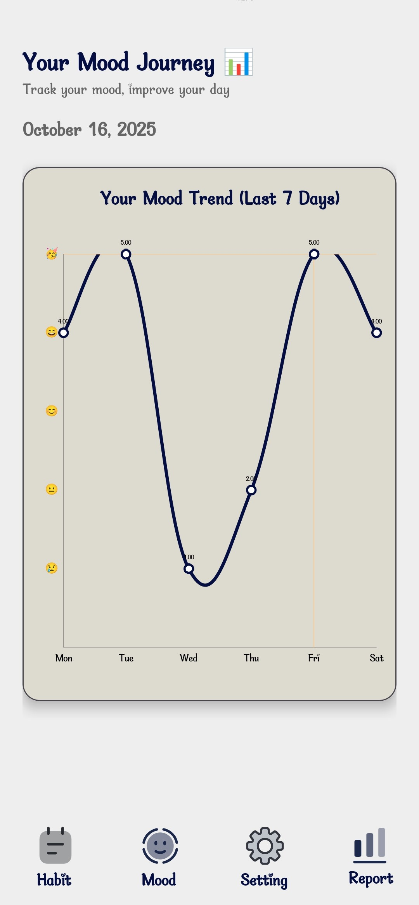
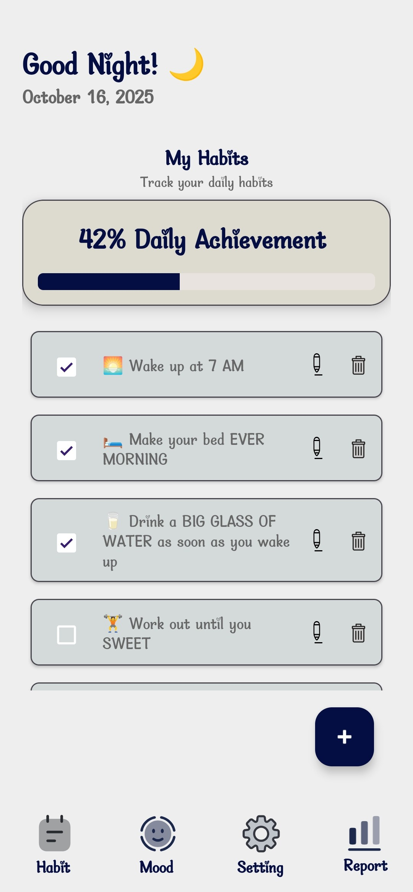
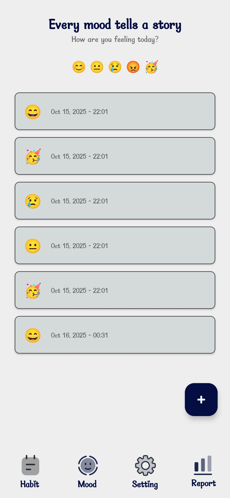
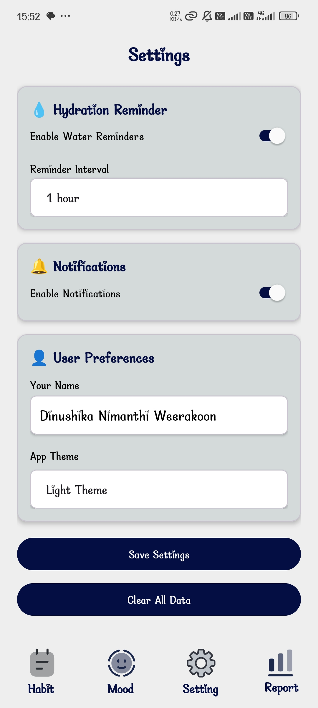

# 🌟 Plan My Day - Daily Habit & Mood Tracker App

A wellness-focused Android application built using **Kotlin** that helps users manage daily habits, track moods, and stay hydrated. The app uses Fragments, RecyclerViews, ViewModel, Intents, and SharedPreferences to deliver a responsive and interactive experience.

---

## 📌 Features

### ✅ Daily Habit Tracker
- Add, edit, and delete daily wellness habits (e.g., drink water, meditate, exercise).
- Track daily completion progress.
- Scrollable list of habits using **RecyclerView** with custom **Adapters** and **ViewHolders**.

### 😊 Mood Journal with Emoji Selector
- Record daily mood entries with date/time and emoji.
- View mood history in a simple list.
- Visualize mood trends over a week using **MPAndroidChart** (Advanced Feature).

### 💧 Hydration Reminder
- Reminders at user-selected intervals: 1, 2, or 3 hours.
- Notifications handled via Android **AlarmManager** or **WorkManager**.
- Persistent hydration settings across sessions.

### 🎨 Settings & Themes
- Customize themes for the app.
- Configure reminder intervals.
- All settings stored using **SharedPreferences**.

---

## 🧩 Technical Overview

### ✔ Architecture
- **MVVM (Model-View-ViewModel)** architecture using ViewModels to manage UI data and survive configuration changes.
- **Fragments** for page navigation (Habits, Mood Journal, Settings, Dashboard).

### ✔ Navigation
- Explicit **Intents** to move between screens.
- Smooth navigation between Fragments for better user experience.

### ✔ Data Persistence
- **SharedPreferences** used to store small datasets: habits, moods, hydration settings, and themes.

### ✔ UI Components
- **RecyclerView** for displaying habits and mood entries.
- **MPAndroidChart** to visualize mood trends.
- Responsive layouts supporting portrait and landscape on phones and tablets.

### ✔ Tools & Libraries
- Kotlin
- Android Studio
- RecyclerView
- ViewModel & LiveData
- SharedPreferences
- MPAndroidChart
- AlarmManager / WorkManager

---

## 📱 Screenshots
<table>
  <tr>
    <td></td>
    <td></td>
  </tr>
  <tr>
    <td></td>
    <td></td>
  </tr>
</table>

